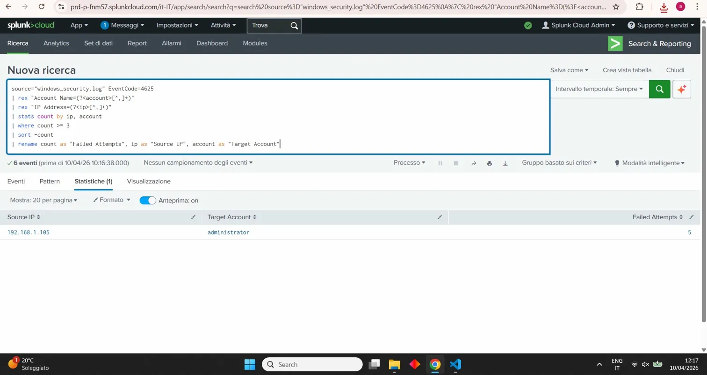

# SOC Lab — Brute Force Detection with Splunk

## Scenario
A Windows endpoint generated multiple failed authentication events
in a short timeframe. I ingested the logs into Splunk Cloud and
used SPL queries to identify a brute force attack against the
administrator account.

## Objective
Simulate a Tier 1 SOC analyst workflow using Splunk:
1. Ingest Windows Security event logs into Splunk Cloud
2. Query failed logon events (EventCode 4625) using SPL
3. Identify brute force patterns by counting failed attempts per IP
4. Produce an incident report with verdict and recommendations

## Tools Used
- Splunk Cloud (free trial)
- SPL (Search Processing Language)
- Windows Security Event Logs (simulated)

## Detection Logic

### Query 1 — Failed Logon Events
```spl
source="windows_security.log" EventCode=4625
| rex "Account Name=(?<account>[^,]+)"
| rex "IP Address=(?<ip>[^,]+)"
| rex "Failure Reason=(?<reason>[^\n]+)"
| table _time, account, ip, reason
| sort _time
```

### Query 2 — Brute Force Detection
```spl
source="windows_security.log" EventCode=4625
| rex "Account Name=(?<account>[^,]+)"
| rex "IP Address=(?<ip>[^,]+)"
| stats count by ip, account
| where count >= 3
| sort -count
| rename count as "Failed Attempts", ip as "Source IP", account as "Target Account"
```

## Results
- **Source IP:** 192.168.1.105
- **Target Account:** administrator
- **Failed Attempts:** 5 in 4 seconds
- **VERDICT: BRUTE FORCE DETECTED**

## 🎯 MITRE ATT&CK Mapping

| Technique | ID | Description |
|-----------|-----|-------------|
| Brute Force: Password Guessing | [T1110.001](https://attack.mitre.org/techniques/T1110/001/) | Multiple failed logon attempts against a single account |
| Brute Force: Password Spraying | [T1110.003](https://attack.mitre.org/techniques/T1110/003/) | High volume of failures across short timeframe |
| Valid Accounts | [T1078](https://attack.mitre.org/techniques/T1078/) | Potential objective if brute force succeeds |

**Tactic:** Credential Access (TA0006)

## 📸 Screenshot



## What I Learned
- How to ingest and parse Windows Security logs in Splunk Cloud
- How to write SPL queries for threat detection
- How to identify brute force patterns using stats and aggregation
- How SPL compares to KQL (Microsoft Sentinel)

---

## 🔗 Related Projects

| Project | Description |
|---------|-------------|
| [detection-engineering-rules](https://github.com/AurelioAvila/detection-engineering-rules) | YARA + Sigma detection rules validated against synthetic true/false-positive test cases |
| [ransomware-dfir-timeline](https://github.com/AurelioAvila/ransomware-dfir-timeline) | Multi-source DFIR timeline reconstruction of a ransomware incident, MITRE-mapped, full analyst write-up |
| [soc-home-lab](https://github.com/AurelioAvila/soc-home-lab) | End-to-end SOC lab with Wazuh + OpenSearch, MITRE-mapped detection & triage |
| [malware-triage-hash](https://github.com/AurelioAvila/malware-triage-hash) | Python SHA256 triage via VirusTotal API + Sentinel KQL hunt rule |
| [phishing-email-analysis](https://github.com/AurelioAvila/phishing-email-analysis) | .eml parser and IOC extractor with VirusTotal enrichment |
| [network-traffic-analysis](https://github.com/AurelioAvila/network-traffic-analysis) | Python + Scapy PCAP analyzer with MITRE mapping |
